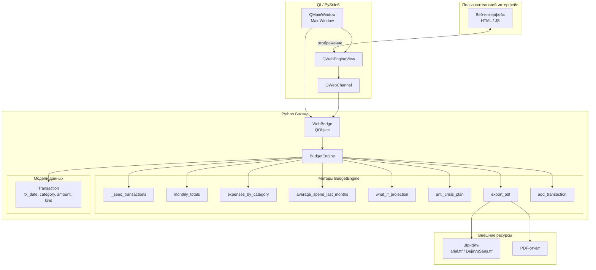
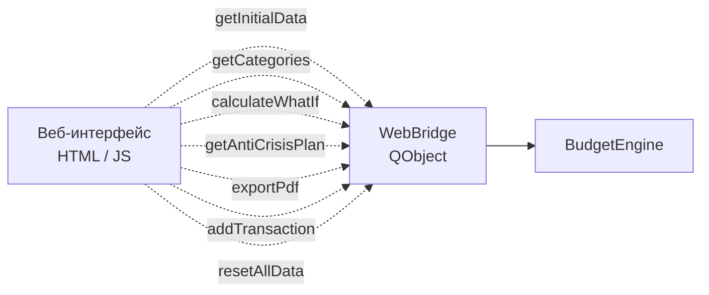

[cash-architecture.md](https://github.com/user-attachments/files/28576191/cash-architecture.md)
https://vk.com/away.php?to=https%3A%2F%2Fdrive.google.com%2Ffile%2Fd%2F1zGlVLN3wwZSzi1on8pDTLqW9dc3DIhyw%2Fview%3Fusp%3Ddrive_link&utf=1
# Архитектура приложения (Budget / Cash)

Десктопное приложение для учёта бюджета: веб-интерфейс внутри Qt-окна, связь через QWebChannel и Python-бэкенд с движком расчётов.

## Общая схема

## API WebBridge → веб-интерфейс

Методы, вызываемые из JavaScript через QWebChannel (пунктирные связи на исходной диаграмме):

## Слои

| Слой | Компоненты | Назначение |
|------|------------|------------|
| **Пользовательский интерфейс** | HTML / JS | UI: таблицы, графики, формы |
| **Qt / PySide6** | MainWindow, QWebEngineView, QWebChannel | Окно приложения и мост к веб-странице |
| **Python Бэкенд** | WebBridge, BudgetEngine | Бизнес-логика и расчёты |
| **Модели данных** | Transaction | Структура транзакции |
| **Внешние ресурсы** | Шрифты, PDF | Экспорт отчётов |

## Методы BudgetEngine

| Метод | Описание |
|-------|----------|
| `_seed_transactions` | Начальное заполнение тестовыми данными |
| `monthly_totals` | Итоги по месяцам |
| `expenses_by_category` | Расходы по категориям |
| `average_spend_last_months` | Средние траты за последние месяцы |
| `what_if_projection` | Прогноз «что если» |
| `anti_crisis_plan` | Антикризисный план |
| `export_pdf` | Экспорт отчёта в PDF |
| `add_transaction` | Добавление транзакции |

